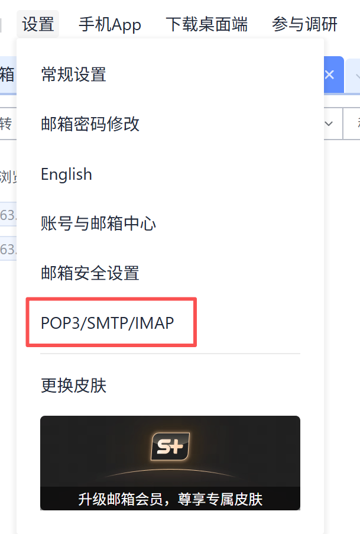
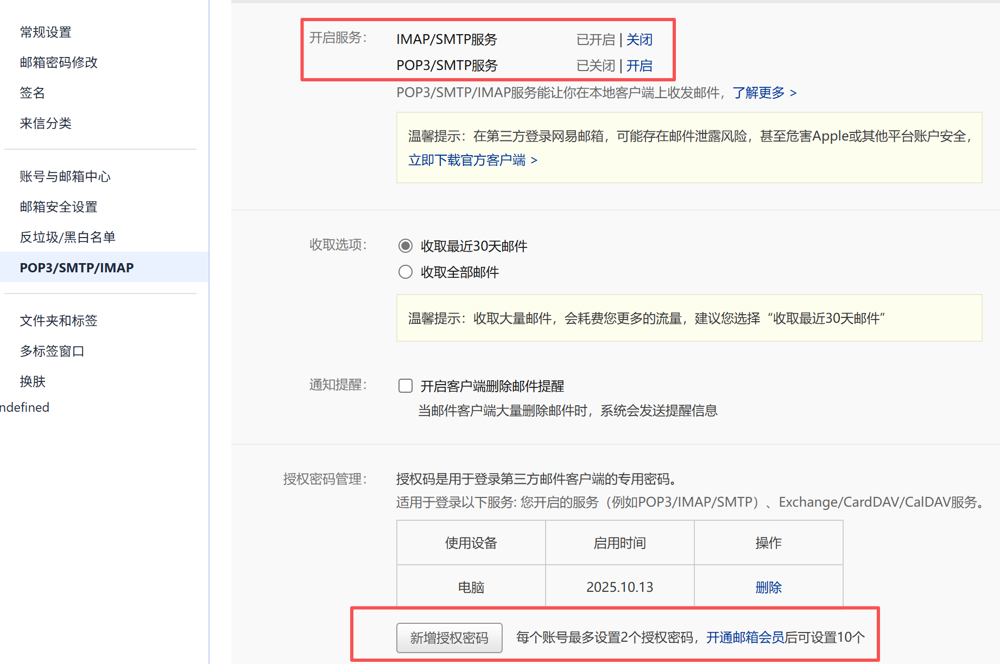

## 1. Sign in to Your 163 Mail Account  
1. Open your browser and go to https://mail.163.com  
2. Enter your email address and password, then log in.

## 2. Navigate to Account Settings  

Setting->POP3/SMTP/IMAP

## 3. Enable SMTP/POP3 Service  
1. In the left sidebar, choose **POP3/SMTP/IMAP** (POP3/SMTP服务).  
2. Check “Enable POP3/SMTP service” (开启POP3/SMTP服务).  
3. You may be prompted to verify via SMS—follow the on-screen steps 
## 4. Generate Your Authorization Code  
1. After enabling the service, click **Generate Authorization Code** (客户端授权密码).  
2. A pop-up will show a 16-character code.  
3. Copy this code now—you won’t see it again.

## 5. Configure Your Email Client or Script  
Write the following personal data to **secret.yaml**, and do not share it with others.
You can rename `secret.yaml.example` to `secret.yaml`.

| Setting        | Value                    |
|----------------|--------------------------|
| SMTP Server    | smtp.163.com             |
| smtp_port           | 465 (SSL)|
| sender_email       | your_full_address@163.com|
| sender_password       | your 16-character code   |

## 6. Test Your SMTP Connection  
1. Send a test email by running `test_email.py`
